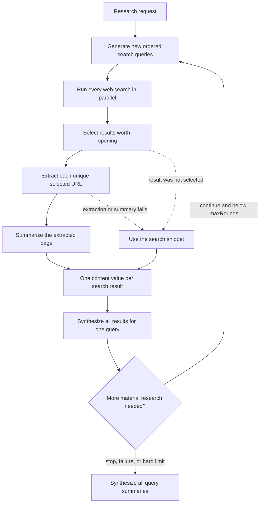

# How deep search works

Deep search turns one research request into a final answer through a sequence of
search and LLM stages. It does not send raw search results or raw web pages
directly to the final-answer model. Instead, it progressively reduces the
evidence into page summaries, then query summaries, and finally one answer.

This document explains that data flow. For the HTTP API, event contract,
persistence model, and complete failure matrix, see
[Deep-search jobs](deep-search-jobs.md).

## Pipeline at a glance



The important boundary is the final step: the final-answer model sees the
original research request and the completed query summaries. It does not see
the raw pages, result-selection output, or search-result snippets directly.
Every cumulative-summary prompt keeps one entry per query under a shared
character ceiling; only the in-memory prompt projection is shortened, never the
durable summary rows.

## 1. Start a durable job

The client submits:

```json
{
  "researchRequest": "What changed in the market?",
  "maxSearches": 3,
  "maxResultsPerSearch": 3,
  "maxRounds": 3
}
```

All three limits default to `3`. Application configuration sets configurable
ceilings and also limits `maxSearches * maxResultsPerSearch`, which bounds the
maximum number of selected URLs in each round. `maxRounds` is an unconditional
hard stop; the model cannot override it. The root workflow has a second
aggregate worst-case selected-page bound so multiplying child searches and
rounds cannot bypass the per-round limit.

Before starting the research pipeline, the API creates an in-memory event log,
generates a short title and slug, and inserts the job in SQLite. It then returns
the job ID and slug while the research continues in the background. Closing the
browser does not cancel the job. Standalone requests are rejected with `429`
when the user already has the active root-workflow limit. Accepted pipelines
wait in the process-wide deep-search queue when both execution slots are busy.
Admission is reserved before title generation. Newly admitted roots take
priority over queued children, while running work is never pre-empted.

## 2. Generate search queries

In the first round, the query-generation model receives:

- the original research request; and
- the exact requested number of searches.

In later rounds it also receives every previously executed query and every
completed query summary. It is instructed to return a structured array of new,
prioritized queries that address remaining gaps. Queries should cover distinct,
useful angles rather than repeat the same search with minor wording changes.
Relevant angles can include subquestions, alternative terminology, primary
sources, counterarguments, and recent developments.

The API validates every array element as a non-empty string, removes
case-insensitive exact duplicates within and across rounds while preserving
order, and applies the requested per-round limit. Therefore, the number of
executed searches can be lower than `maxSearches`. An empty first-round list
leads to final-answer generation with no query summaries. An empty later-round
list ends exploration and keeps the earlier summaries.

Prompt: [generate-websearch-queries.md](../../llms/prompts/generate-websearch-queries.md)

Implementation: [queries.ts](../../agents/deep_search/queries.ts)

## 3. Search the web

All generated queries are sent to the configured search provider concurrently.
Development and test use SearXNG; production uses Brave Search. Provider output
is capped, normalized, and deduplicated to at most 30 rows per query with three
fields:

```ts
{
  title: string
  shortText: string // the search-engine snippet
  link: string      // a validated URL
}
```

The snippet is required because it is the fallback evidence when a result is
not opened or its page cannot be extracted and summarized. Titles, snippets,
and URLs have fixed field limits. Only public extractable HTTPS URLs survive;
tracking parameters, fragments, and equivalent trailing slashes are
canonicalized before first-ranked deduplication.

Every provider call receives a configured abort deadline (30 seconds by
default), and the HTTP response is rejected when its declared or streamed body
exceeds the configured 2 MB default.

Implementation: [web_search/index.ts](../../web_search/index.ts)

## 4. Select results to explore

For each executed query, the selection model receives:

- the original research request;
- the executed search query;
- the exploration limit; and
- every result's stable temporary ID, title, URL, and snippet.

It returns only result IDs, ordered from highest to lowest priority. Using IDs
means the model cannot supply a new URL for the extractor. Unknown IDs are
ignored when the API maps the selection back to the original results; an empty
ID likewise matches nothing and is treated as selecting no result.

All result fields are serialized as untrusted data inside the prompt. A title
or snippet that contains XML-like text or instructions cannot alter the prompt
structure or override the selector's system instructions.

The selection prompt favors relevant evidence, primary sources, independent
verification, and useful contrary evidence. It may choose fewer than the limit,
including no results.

Prompt: [select-websearch-results.md](../../llms/prompts/select-websearch-results.md)

Implementation: [selection.ts](../../agents/deep_search/selection.ts)

## 5. Extract selected pages

Each selected URL is extracted at most once per job, even if it appears in more
than one search or round. Selection runs in query priority order. Extraction
starts after every query in the round has completed selection.

ScrapingAnt first tries a cheaper HTTP retrieval. If the returned content is
empty, too short, blocked by an anti-bot challenge, or looks like an error page,
the extractor tries browser rendering through a US datacenter proxy. HTML is
converted to visible text; PDF responses use the PDF extractor. Content shorter
than 200 characters is rejected as unusable.

Only HTML, XHTML, plain text, Markdown, and recognized PDF bodies are accepted.
Other declared media types are rejected. A response without a content type must
still pass a text-likeness check, so a long image or other binary body is never
decoded and summarized as a web page.

If neither retrieval method produces usable content, the page records an
extraction failure and the later query summary uses the original search snippet.
The wider standalone deep-search job can still complete.

Implementation: [webExtract.ts](../../web_search/webExtract.ts)

Operational details: [API runtime](../../docs/runtime.md#real-external-services-in-dev)

## 6. Summarize each extracted page

The page-summary model receives only:

- the original research request;
- the source URL; and
- the visible text extracted from that page.

The prompt asks for a concise, self-contained summary focused on the research
request. It must preserve useful evidence, dates, qualifications, limitations,
and disagreements without adding outside facts.

Hidden reasoning is disabled for page summaries, query summaries, and final
synthesis. DeepSeek counts reasoning and visible text against the same output
budget; these evidence-transformation stages reserve that budget for their
required durable text. Structured selection and round review retain their
separate reasoning policy.

Page content is capped at 100,000 characters before it is sent to the model. If
it is longer, the pipeline preserves roughly the first 75% and last 25%, with an
omission marker between them. This retains introductions and conclusions while
keeping the request bounded.

If summary creation or generation fails, or the model returns no usable text,
the query-summary stage uses the search snippet instead.

Prompt: [summarize-web-page.md](../../llms/prompts/summarize-web-page.md)

Implementation: [summaries.ts](../../agents/deep_search/summaries.ts)

## 7. Synthesize each search query

After all selected page-summary tasks settle, the pipeline creates one query
summary for every executed search. Crucially, this stage receives **all** search
results, not only the selected ones.

Each result has a title, URL, and one uniform `content` value. Page evidence is
deduplicated job-wide, so selection by any query makes the successful summary
available to every result with the same URL:

| Result state | Content passed to the query-summary model |
| --- | --- |
| The URL was selected anywhere in the job and successfully summarized | Full page summary |
| No successful job-wide page summary exists for the URL | Search-engine snippet |

The model is not told whether `content` came from a page summary or a snippet.
It synthesizes the results collectively, preserves source URLs and conflicts,
and must not add facts from outside the supplied material.

All query-summary streams start concurrently. The pipeline waits for every
query summary in the round before it reviews whether more research is needed.
Their serialized result context shares the same aggregate character ceiling as
the other cumulative prompts, retaining a bounded entry for every result.

Prompt: [summarize-search-query.md](../../llms/prompts/summarize-search-query.md)

Implementation: [querySummaries.ts](../../agents/deep_search/querySummaries.ts)

## 8. Decide whether to search again

After a round's query summaries complete, a structured review generation
receives the original request, every accumulated query summary, the number of
completed rounds, and the hard limit. It returns:

```ts
{
  decision: "continue" | "stop"
  reason: string
}
```

The prompt requires a specific, searchable, material evidence gap before
choosing `continue`; asking for more volume is insufficient. Search summaries
are explicitly treated as untrusted data so page content cannot instruct the
review model. A `continue` decision starts the next round with prior queries and
summaries as context. The final allowed round skips review because no decision
can exceed `maxRounds`.

Review is optional control logic. If registration, generation, parsing, or
persistence fails, exploration stops and final synthesis uses the evidence
already collected. The wider job does not fail.

Prompt: [review-deep-search-round.md](../../llms/prompts/review-deep-search-round.md)

Implementation: [reviewRound.ts](../../agents/deep_search/reviewRound.ts)

## 9. Produce the final answer

The final-answer model receives:

- the original research request; and
- every completed query summary from every round, labeled with its search
  query.

It is instructed to synthesize across searches rather than repeat each summary
in sequence. It should preserve facts, links, limitations, uncertainty, and
conflicting evidence. It cannot inspect a raw page at this stage, so information
omitted by both the page and query summaries cannot be recovered in the final
answer.

Prompt: [answer-research-request.md](../../llms/prompts/answer-research-request.md)

Implementation: [finalAnswer.ts](../../agents/deep_search/finalAnswer.ts)

## Ordering and concurrency

The complete sequence below is owned by
`routes/deepSearch/pipeline.ts`. Agent modules expose concrete generation,
search, and extraction operations but do not publish job events or control the
next workflow stage. `routes/deepSearch/run.ts` owns the surrounding durable job
lifecycle.

The pipeline deliberately mixes sequential and concurrent work:

1. Query generation must complete before any search starts.
2. Web searches for all queries run concurrently.
3. Result selection runs one query at a time, in generated-query priority order.
4. After all selections finish, unique page extraction and summarization tasks
   enter a process-wide queue with a small configured concurrency. The
   ScrapingAnt client further serializes only the provider requests through its
   own single-request queue.
5. Query summaries start concurrently after every page task has settled.
6. The round review starts only after the round's query summaries complete.
7. A `continue` decision repeats steps 1–6 with globally deduplicated queries
   and URLs.
8. Final synthesis starts only after exploration stops or reaches `maxRounds`.

This ordering preserves query priority in the UI and database while overlapping
the slow page work where possible.

## Failure behavior

Pipeline-wide planning, search, selection, and synthesis failures are normally
fatal. Failures while opening or summarizing an individual page are recoverable
because its snippet remains available.

| Failure | Outcome |
| --- | --- |
| Query generation | Job fails; no searches start |
| Web search | Job fails; selection does not start |
| Result selection | Query and job fail; page extraction does not start |
| Page extraction | Page fails; query synthesis uses its snippet |
| Page summary | Page fails; query synthesis uses its snippet |
| Query summary | Job fails; final synthesis does not start |
| Round review | Exploration stops; final synthesis uses current evidence |
| Final answer | Job fails |

See [Deep-search jobs](deep-search-jobs.md) for persistence details and the
stricter behavior when a deep search belongs to an idea job.

## Streaming and persistence

Each LLM call has its own stream ID. The deep-search event feed announces those
IDs through `query-stream`, `selection-stream`, `page-summary-stream`,
`query-summary-stream`, `round-review-stream`, and `final-answer-stream` events.
Round-scoped events carry a zero-based `round`, and review outcomes use the
typed `round-review` or `round-review-error` events. The client then reads the
corresponding LLM streams to display reasoning and text while generation is
running.

The server-side pipeline does not subscribe to those public streams to recover
its own results. Each model-backed stage returns the stream ID, a durable
completion promise, and its typed result promise. The pipeline publishes the ID
for clients, then awaits the typed result. Structured results settle only after
both schema validation and terminal generation persistence have settled; text
results come directly from the durable generation outcome.

Page-summary and query-summary streams use the text registry's transactional
lifecycle hooks. Their generation link commits before consumption starts, and
their terminal page or query status commits with the generation's terminal
outcome. Provider page-summary failures therefore enable snippet fallback
without a later repair scan, while query-summary failures become durable before
the pipeline raises the fatal error. The final-answer stream uses the same
boundary: its completion hook verifies every required query and atomically
commits the final generation and completed job. The runner returns that durable
text directly. Fatal pipeline cleanup atomically fails all still-active query
and page rows with the owning job before publishing the terminal error.

Live deltas stay in memory. Completed text, reasoning, status, and errors are
stored in SQLite. Structural state—rounds, reviews, generated queries, executed
searches, results, selections, pages, and generation links—is stored in
normalized tables at stage boundaries. This lets completed jobs be
reconstructed after restart without storing a duplicate JSON snapshot or
database event log.

Those structural writes are exposed as explicit persistence commands that use
stable database IDs and transactional multi-row updates. The pipeline calls
those commands before publishing the corresponding event and carries their
small typed records forward instead of querying rows back by display text.
Events are presentation notifications, not the persistence API. No
event-to-database adapter remains.

See [Text streaming](text-streaming.md) for the LLM stream lifecycle and
[Deep-search jobs](deep-search-jobs.md#persistence-model) for the database model.
