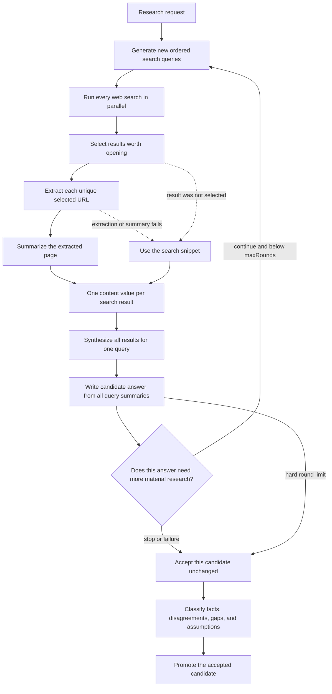

# How deep search works

Deep search turns one research request into a final answer through a sequence of
search and LLM stages. It does not send raw search results or raw web pages
directly to the answer model. Instead, it progressively reduces the evidence
into page summaries and query summaries, then writes and reviews one candidate
answer per round. The accepted or last permitted candidate becomes the final
answer without being generated again.

This document explains that data flow. For the HTTP API, event contract,
persistence model, and complete failure matrix, see
[Deep-search jobs](deep-search-jobs.md).

## Pipeline at a glance



The important boundary is candidate generation: the answer model sees the
original research request and every completed query summary so far. It does not
see raw pages, result-selection output, or search-result snippets directly.
The reviewer then sees that candidate plus the same accumulated evidence.
Every cumulative-summary prompt keeps one entry per query under a shared
character ceiling; only the in-memory prompt projection is shortened, never the
durable summary rows.

## Implementation code map

```text
HTTP routes
`- routes/deepSearch/index.ts
   `- manager.ts                 admission, creation, queue, live log, root controller
      |- cancellation.ts         owner/root stop compare-and-swap
      `- run.ts                  terminal success/failure/interruption events
         `- pipeline.ts          Effect-owned rounds, ordering, fan-outs, fallbacks
            |- agents/deep_search/*   prompts, provider calls, extraction, validation
            |- store.ts               transactional round/query/result/page writes
            `- jobLifecycle.ts        transactional job completion and fatal cleanup

Durable replay
`- routes/deepSearch/replay.ts   normalized SQLite rows -> reducer-compatible events

Browser presentation
`- web/lib/deepSearchJobs.ts     HTTP schemas and NDJSON subscription
   `- web/lib/useDeepSearchJob.ts    reconnect and replay lifecycle
      `- web/lib/deepSearchState.ts  event reducer
         `- web/pages/DeepSearch/*   history, detail route, and rendered progress
```

- [index.ts](../deepSearch/index.ts) owns authenticated creation, history, and
  root Stop plus the scoped detail/event reads.
- [manager.ts](../deepSearch/manager.ts) admits work, creates the durable job
  before execution, retains its live event log and root controller, and
  schedules the runner.
- [run.ts](../deepSearch/run.ts) surrounds the coordinator with failure or
  interruption persistence and the single terminal `done` event.
- [pipeline.ts](../deepSearch/pipeline.ts) is the only research-loop
  coordinator. It uses Effect for orchestration, decides what stage runs next,
  and publishes progress only after the owning database write commits.
- Modules under [agents/deep_search](../../agents/deep_search/) format prompts,
  call models or extraction providers, validate outputs, and return handles or
  typed outcomes. They do not control the workflow or publish job events.
- [store.ts](../deepSearch/store.ts) and
  [jobLifecycle.ts](../deepSearch/jobLifecycle.ts) own normalized transactional
  mutations; [replay.ts](../deepSearch/replay.ts) converts those durable facts
  back into presentation events.
- In the browser, [deepSearchJobs.ts](../../../web/lib/deepSearchJobs.ts)
  validates HTTP and NDJSON data, [useDeepSearchJob.ts](../../../web/lib/useDeepSearchJob.ts)
  owns reconnection, [deepSearchState.ts](../../../web/lib/deepSearchState.ts)
  reduces the replayed feed, and [pages/DeepSearch](../../../web/pages/DeepSearch/)
  renders it.

## 1. Start a durable job

The client submits:

```json
{
  "researchRequest": "What changed in the market?",
  "maxSearches": 3,
  "maxResultsPerSearch": 3,
  "maxRounds": 2
}
```

Search count and results per search default to `3`; rounds default to `2`.
Application configuration sets configurable
ceilings and also limits `maxSearches * maxResultsPerSearch`, which bounds the
maximum number of selected URLs in each round. `maxRounds` is an unconditional
hard stop; the model cannot override it. The root workflow has a second
aggregate worst-case selected-page bound so multiplying child searches and
rounds cannot bypass the per-round limit.

Before starting the research pipeline, the API creates an in-memory event log,
generates a short title and slug, and inserts the job in SQLite. It then returns
the job ID and slug while the research continues in the background. Closing the
browser does not cancel the job. Standalone requests are rejected with `429`
when the user already has the active root-workflow limit. Accepted pipelines
wait in the process-wide deep-search queue when both execution slots are busy.
Admission is reserved before title generation. Newly admitted roots take
priority over queued children, while running work is never pre-empted.

The owner may explicitly stop a running standalone root. The manager first
persists the root stop timestamp, publishes `stop-requested`, then aborts queued
or active work through its workflow controller. Child searches cannot be
stopped directly; active children inherit their idea or debate root's signal
and derive the root timestamp without copying it. The inherited signal
publishes the same `stop-requested` event in each affected child's live feed,
and durable replay derives that event from the effective root. A child already
completed before the root timestamp stays completed and gains no Stop event.
Already-started callbacks settle before the durable job becomes interrupted. See
[Deep-search jobs](deep-search-jobs.md#post-apideep-search-jobsdeepsearchjobidcancel)
for the HTTP and event contract.

## 2. Generate search queries

In the first round, the query-generation model receives:

- the original research request; and
- the exact requested number of searches.

In later rounds it also receives every previously executed query, every
completed query summary, the previous candidate answer, and the critic's reason
for continuing. It is instructed to return a structured array of new,
prioritized queries that address the stated deficiency without repeating prior
work. Queries should cover distinct, useful angles rather than repeat the same
search with minor wording changes.
Relevant angles can include subquestions, alternative terminology, primary
sources, counterarguments, and recent developments.

The API validates every array element as a non-empty string, removes
case-insensitive exact duplicates within and across rounds while preserving
order, and applies the requested per-round limit. Therefore, the number of
executed searches can be lower than `maxSearches`. An empty list performs no
retrieval in that round, but still produces a candidate from the accumulated
summaries and remains bounded by review plus `maxRounds`.

Prompt: [generate-websearch-queries.md](../../llms/prompts/generate-websearch-queries.md)

Implementation: [queries.ts](../../agents/deep_search/queries.ts)

## 3. Search the web

All generated queries are submitted to the configured search provider.
Development and test use SearXNG; production uses Serper with a process-wide
queries-per-second limit. Provider output is capped, normalized, and
deduplicated to at most 30 rows per query with three fields:

```ts
{
  title: string
  shortText: string // the search-engine snippet
  link: string      // a validated URL
}
```

The snippet is required because it is the fallback evidence when a result is
not opened or its page cannot be extracted and summarized. Titles, snippets,
and URLs have fixed field limits. Only public extractable HTTPS URLs survive;
tracking parameters, fragments, and equivalent trailing slashes are
canonicalized before first-ranked deduplication.

Every provider call receives a configured abort deadline (30 seconds by
default), and the HTTP response is rejected when its declared or streamed body
exceeds the configured 2 MB default.

Implementation: [web_search/index.ts](../../web_search/index.ts)

## 4. Select results to explore

For each executed query, the selection model receives:

- the original research request;
- the executed search query;
- the exploration limit; and
- every result's stable temporary ID, title, URL, and snippet.

It returns only result IDs, ordered from highest to lowest priority. Using IDs
means the model cannot supply a new URL for the extractor. Unknown IDs are
ignored when the API maps the selection back to the original results; an empty
ID likewise matches nothing and is treated as selecting no result.

All result fields are serialized as untrusted data inside the prompt. A title
or snippet that contains XML-like text or instructions cannot alter the prompt
structure or override the selector's system instructions.

The selection prompt favors relevant evidence, primary sources, independent
verification, and useful contrary evidence. It may choose fewer than the limit,
including no results.

Prompt: [select-websearch-results.md](../../llms/prompts/select-websearch-results.md)

Implementation: [selection.ts](../../agents/deep_search/selection.ts)

## 5. Extract selected pages

Each selected URL is extracted at most once per job, even if it appears in more
than one search or round. Selection runs in query priority order. Extraction
starts after every query in the round has completed selection.

ScrapingAnt first tries a cheaper HTTP retrieval. If the returned content is
empty, too short, blocked by an anti-bot challenge, or looks like an error page,
the extractor tries browser rendering through a US datacenter proxy. HTML is
converted to visible text; PDF responses use the PDF extractor. Content shorter
than 200 characters is rejected as unusable.

Only HTML, XHTML, plain text, Markdown, and recognized PDF bodies are accepted.
Other declared media types are rejected. A response without a content type must
still pass a text-likeness check, so a long image or other binary body is never
decoded and summarized as a web page.

If neither retrieval method produces usable content, the page records an
extraction failure and the later query summary uses the original search snippet.
The wider standalone deep-search job can still complete.

Implementation: [webExtract.ts](../../web_search/webExtract.ts)

Operational details: [API runtime](../../docs/runtime.md#real-external-services-in-dev)

## 6. Summarize each extracted page

The page-summary model receives only:

- the original research request;
- the source URL; and
- the visible text extracted from that page.

The prompt asks for a concise, self-contained summary focused on the research
request. It must preserve useful evidence, dates, qualifications, limitations,
and disagreements without adding outside facts.

Hidden reasoning is disabled for page summaries, query summaries, and
candidate-answer synthesis. DeepSeek counts reasoning and visible text against the same output
budget; these evidence-transformation stages reserve that budget for their
required durable text. Structured selection and round review retain their
separate reasoning policy.

Page content is capped at 100,000 characters before it is sent to the model. If
it is longer, the pipeline preserves roughly the first 75% and last 25%, with an
omission marker between them. This retains introductions and conclusions while
keeping the request bounded.

If summary creation or generation fails, or the model returns no usable text,
the query-summary stage uses the search snippet instead.

Prompt: [summarize-web-page.md](../../llms/prompts/summarize-web-page.md)

Implementation: [summaries.ts](../../agents/deep_search/summaries.ts)

## 7. Synthesize each search query

After all selected page-summary tasks settle, the pipeline creates one query
summary for every executed search. Crucially, this stage receives **all** search
results, not only the selected ones.

Each result has a title, URL, and one uniform `content` value. Page evidence is
deduplicated job-wide, so selection by any query makes the successful summary
available to every result with the same URL:

| Result state | Content passed to the query-summary model |
| --- | --- |
| The URL was selected anywhere in the job and successfully summarized | Full page summary |
| No successful job-wide page summary exists for the URL | Search-engine snippet |

The model is not told whether `content` came from a page summary or a snippet.
It synthesizes the results collectively, preserves source URLs and conflicts,
and must not add facts from outside the supplied material.

All query-summary streams start concurrently. The pipeline waits for every
query summary in the round before it writes the candidate answer.
Their serialized result context shares the same aggregate character ceiling as
the other cumulative prompts, retaining a bounded entry for every result.

Prompt: [summarize-search-query.md](../../llms/prompts/summarize-search-query.md)

Implementation: [querySummaries.ts](../../agents/deep_search/querySummaries.ts)

## 8. Decide whether to search again

After a round's query summaries complete, the pipeline first writes a candidate
answer from all accumulated summaries. A structured review generation then
receives the original request, that candidate, every accumulated query summary,
the number of completed rounds, and the hard limit. It returns:

```ts
{
  decision: "continue" | "stop"
  reason: string
}
```

The prompt requires a specific, searchable, material deficiency in the answer
before choosing `continue`; asking for more volume is insufficient. Its reason
must explain why the candidate is inadequate and what concrete evidence the
next round should seek. Summaries and candidate text are explicitly treated as
untrusted data. A `continue` decision starts the next round with prior queries,
summaries, the candidate, and this reason as context. The final allowed round
skips review because no decision can exceed `maxRounds`.

Review is optional control logic. If registration, generation, parsing, or
persistence fails, exploration stops and the current candidate is promoted.
The wider job does not fail.

Prompt: [review-deep-search-round.md](../../llms/prompts/review-deep-search-round.md)

Implementation: [reviewRound.ts](../../agents/deep_search/reviewRound.ts)

## 9. Produce and promote the answer

Every round's candidate-answer model receives:

- the original research request; and
- every completed query summary from every round, labeled with its search
  query.

It is instructed to synthesize across searches rather than repeat each summary
in sequence. It should preserve facts, links, limitations, uncertainty, and
conflicting evidence. It cannot inspect a raw page at this stage, so information
omitted by both the page and query summaries cannot be recovered in the final
answer. The candidate stream is attached to its round before generation starts.

When review returns `stop`, review fails, or the round hard limit is reached,
the accepted candidate is passed to the separate structured research-analysis
stage described below. After that stage completes, the job atomically points
`finalAnswerGenerationId` at the completed candidate generation and becomes
terminal. No answer text is copied and no second final-answer model call runs.

Prompt: [answer-research-request.md](../../llms/prompts/answer-research-request.md)

Implementation: [finalAnswer.ts](../../agents/deep_search/finalAnswer.ts)

## 10. Analyse the accepted answer

One separate structured model call receives the original request, the accepted
answer, and every accumulated query summary. It classifies the result into:

- supported facts, with source URLs;
- material disagreements, with source URLs;
- unresolved gaps;
- material assumptions, with source URLs.

The output is constrained and parsed with Zod. Titles, descriptions, collection
sizes, and source URLs are bounded. The model is instructed to cite only URLs
present in the supplied answer or summaries and to return an empty array when a
category has no defensible item. Hidden reasoning is disabled because this is an
evidence-transformation stage with a bounded structured output.

The structured JSON remains in its owned `llm_generations` row and the job stores
only its generation link. Completed replay parses that validated JSON rather
than copying the four collections into another table. The browser receives a
typed `research-analysis` event, not the raw structured generation stream.

Prompt: [analyze-research-answer.md](../../llms/prompts/analyze-research-answer.md)

Implementation: [researchAnalysis.ts](../../agents/deep_search/researchAnalysis.ts)

## Ordering and concurrency

The complete sequence below is owned by
`routes/deepSearch/pipeline.ts` using `Effect.gen`, with one Promise-facing
runtime boundary. Agent modules expose concrete generation, search, and
extraction operations but do not publish job events or control the next
workflow stage. `routes/deepSearch/run.ts` owns the surrounding durable job
lifecycle. Concurrent web-search, page, and query-summary fan-outs use
result-mode settling so every started operation finishes cleanup before an
input-order-stable failure is selected. Existing process-wide queues continue
to own provider backpressure.

The pipeline deliberately mixes sequential and concurrent work:

1. Query generation must complete before any search starts.
2. Web searches for all queries run concurrently.
3. Result selection runs one query at a time, in generated-query priority order.
4. After all selections finish, unique page extraction and summarization tasks
   enter a process-wide queue with a small configured concurrency. The
   ScrapingAnt client further serializes only the provider requests through its
   own single-request queue.
5. Query summaries start concurrently after every page task has settled.
6. Candidate-answer generation starts only after the round's query summaries
   complete.
7. The round review starts only after the candidate answer completes.
8. A `continue` decision repeats steps 1–7 with globally deduplicated queries
   and URLs plus the candidate and review reason as planning context.
9. A stopped, failed-review, or final-round candidate receives the separate
   structured research analysis.
10. After that analysis completes, the candidate is promoted unchanged and the
    job becomes terminal.

This ordering preserves query priority in the UI and database while overlapping
the slow page work where possible.

## Failure behavior

Pipeline-wide planning, search, selection, and synthesis failures are normally
fatal. Failures while opening or summarizing an individual page are recoverable
because its snippet remains available.

An explicit root Stop or inherited parent Stop is interruption, not a pipeline
failure. Work-start and normal terminal transactions reject a cancelled
effective root, while cleanup remains allowed to settle nonterminal records.
The terminal job feed emits `interrupted`, then `done`, without an ordinary
`error` event. Provider deadlines remain ordinary failures.

| Failure | Outcome |
| --- | --- |
| Query generation | Job fails; no searches start |
| Web search | Job fails; selection does not start |
| Result selection | Query and job fail; page extraction does not start |
| Page extraction | Page fails; query synthesis uses its snippet |
| Page summary | Page fails; query synthesis uses its snippet |
| Query summary | Job fails; candidate generation does not start |
| Candidate answer | Job fails |
| Structured research analysis | Job fails; the candidate is not promoted |
| Round review | Exploration stops; the current candidate is promoted |

See [Deep-search jobs](deep-search-jobs.md) for persistence details and the
stricter behavior when a deep search belongs to an idea job.

## Streaming and persistence

Each LLM call has its own stream ID. The deep-search event feed announces those
IDs through `query-stream`, `selection-stream`, `page-summary-stream`,
`query-summary-stream`, `round-answer-stream`, `round-review-stream`, and
`final-answer-stream` events.
Round-scoped events carry a zero-based `round`, and review outcomes use the
typed `round-review` or `round-review-error` events. The client then reads the
corresponding LLM streams to display reasoning and text while generation is
running.

The structured research-analysis call is not rendered as an LLM text stream.
After it validates and the job completes, the feed publishes its typed
`research-analysis` payload between `final-answer-stream` and `done`.

The server-side pipeline does not subscribe to those public streams to recover
its own results. Each model-backed stage returns the stream ID, a durable
completion promise, and its typed result promise. The pipeline publishes the ID
for clients, then awaits the typed result. Structured results settle only after
both schema validation and terminal generation persistence have settled; text
results come directly from the durable generation outcome.

Page-summary and query-summary streams use the text registry's transactional
lifecycle hooks. Their generation link commits before consumption starts, and
their terminal page or query status commits with the generation's terminal
outcome. Provider page-summary failures therefore enable snippet fallback
without a later repair scan, while query-summary failures become durable before
the pipeline raises the fatal error. Each candidate-answer generation is linked
to its round before its stream is published. After that generation completes,
the structured analysis runs and stores its generation link. Promotion verifies
every required query, the candidate output, and the completed schema-valid
analysis, then atomically links the candidate as the final answer and completes
the job. The runner returns that durable text directly. Fatal pipeline cleanup atomically fails all
still-active query and page rows with the owning job before publishing the
terminal error. Stop cleanup settles active generation, query, and page records
before publishing the interrupted terminal suffix; interrupted generation
attempts retain partial durable output and do not debit RethinkLoop credits.

Live deltas stay in memory. Completed text, reasoning, status, and errors are
stored in SQLite. Structural state—rounds, reviews, generated queries, executed
searches, results, selections, pages, and generation links—is stored in
normalized tables at stage boundaries. This lets completed jobs be
reconstructed after restart without storing a duplicate JSON snapshot or
database event log.

Those structural writes are exposed as explicit persistence commands that use
stable database IDs and transactional multi-row updates. The pipeline calls
those commands before publishing the corresponding event and carries their
small typed records forward instead of querying rows back by display text.
Events are presentation notifications, not the persistence API. No
event-to-database adapter remains.

See [Text streaming](text-streaming.md) for the LLM stream lifecycle and
[Deep-search jobs](deep-search-jobs.md#persistence-model) for the database model.
