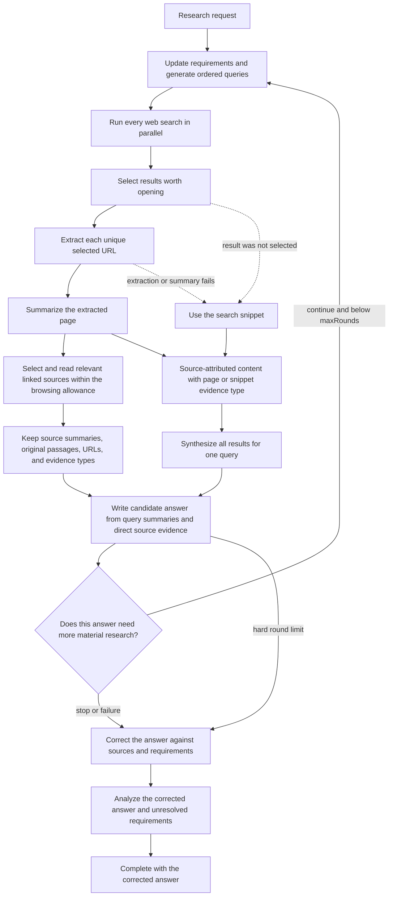

# How deep search works

Deep search turns one research request into a final answer through a sequence of
search and LLM stages. It combines page and query summaries with bounded
verbatim source passages, follows relevant source links, and writes one candidate
answer per round. Planning and review track the user's requirements and remaining
evidence gaps. After exploration stops, a mandatory source-backed correction
produces the delivered answer, followed by a separate structured analysis.

This document explains that data flow. For the HTTP API, event contract,
persistence model, and complete failure matrix, see
[Deep-search jobs](deep-search-jobs.md).

## Pipeline at a glance



The important boundary is candidate generation: the answer model sees the
original research request, every completed query summary, and the selected
sources' page summaries, retained original passages, or explicitly labeled
snippet fallbacks. Failed linked sources have no search snippet and are marked
unavailable. The planner, reviewer, final correction, and final analysis receive
this same source context. Every cumulative
prompt shares one character ceiling across query and source entries. Source
URLs and evidence types survive truncation; durable summaries are unchanged.

## Implementation code map

```text
HTTP routes
`- routes/deepSearch/index.ts
   `- manager.ts                 admission, creation, queue, live log, root controller
      |- cancellation.ts         owner/root stop compare-and-swap
      `- run.ts                  terminal success/failure/interruption events
         `- pipeline.ts          Effect-owned rounds, ordering, fan-outs, fallbacks
            |- agents/deep_search/*   prompts, provider calls, extraction, validation
            |- store.ts               transactional round/query/result/page writes
            `- jobLifecycle.ts        transactional job completion and fatal cleanup

Durable replay
`- routes/deepSearch/replay.ts   normalized SQLite rows -> reducer-compatible events

Browser presentation
`- web/lib/deepSearchJobs.ts     HTTP schemas and NDJSON subscription
   `- web/lib/useDeepSearchJob.ts    reconnect and replay lifecycle
      `- web/lib/deepSearchState.ts  event reducer
         `- web/pages/DeepSearch/*   history, detail route, and rendered progress
```

- [index.ts](../deepSearch/index.ts) owns authenticated creation, history, and
  root Stop plus the scoped detail/event reads.
- [manager.ts](../deepSearch/manager.ts) admits work, creates the durable job
  before execution, retains its live event log and root controller, and
  schedules the runner.
- [run.ts](../deepSearch/run.ts) surrounds the coordinator with failure or
  interruption persistence and the single terminal `done` event.
- [pipeline.ts](../deepSearch/pipeline.ts) is the only research-loop
  coordinator. It uses Effect for orchestration, decides what stage runs next,
  and publishes progress only after the owning database write commits.
- Modules under [agents/deep_search](../../agents/deep_search/) format prompts,
  call models or extraction providers, validate outputs, and return handles or
  typed outcomes. They do not control the workflow or publish job events.
- [store.ts](../deepSearch/store.ts) and
  [jobLifecycle.ts](../deepSearch/jobLifecycle.ts) own normalized transactional
  mutations; [replay.ts](../deepSearch/replay.ts) converts those durable facts
  back into presentation events.
- In the browser, [deepSearchJobs.ts](../../../web/lib/deepSearchJobs.ts)
  validates HTTP and NDJSON data, [useDeepSearchJob.ts](../../../web/lib/useDeepSearchJob.ts)
  owns reconnection, [deepSearchState.ts](../../../web/lib/deepSearchState.ts)
  reduces the replayed feed, and [pages/DeepSearch](../../../web/pages/DeepSearch/)
  renders it.

## 1. Start a durable job

The client submits:

```json
{
  "researchRequest": "What changed in the market?",
  "maxSearches": 3,
  "maxResultsPerSearch": 3,
  "maxRounds": 2
}
```

Search count, results per search, and rounds default to `3`.
Application configuration sets configurable
ceilings and also limits `maxSearches * maxResultsPerSearch`, which bounds the
maximum number of search-selected URLs in each round. Bounded link traversal
may select three times as many additional URLs per round; admission includes
both allowances. With `B = min(maxSearches * maxResultsPerSearch,
maxSelectedUrlsPerRound)`, a round admits up to `B` search-selected and `3B`
linked pages. Disabling link exploration removes the `3B` allowance. `maxRounds` is an unconditional
hard stop; the model cannot override it. The root workflow has a second
aggregate worst-case selected-page bound so multiplying child searches and
rounds cannot bypass the per-round limit.

Before starting the research pipeline, the API creates an in-memory event log,
generates a short title and slug, and inserts the job in SQLite. It then returns
the job ID and slug while the research continues in the background. Closing the
browser does not cancel the job. Standalone requests are rejected with `429`
when the user already has the active root-workflow limit. Accepted pipelines
wait in the process-wide deep-search queue when both execution slots are busy.
Admission is reserved before title generation. Newly admitted roots take
priority over queued children, while running work is never pre-empted.

On startup, the server schedules every non-completed standalone deep search as
an effective root. The same checkpoint reconciler runs when an owner resumes a
failed or interrupted root. It reconstructs normalized rounds, queries, pages,
and generation links, reuses every valid completed checkpoint, and retries only
incomplete work. Idea-owned searches are never scheduled as roots; their idea
or debate coordinator resumes them recursively.

The owner may explicitly stop a running standalone root. The manager first
persists the root stop timestamp, publishes `stop-requested`, then aborts queued
or active work through its workflow controller. Child searches cannot be
stopped directly; active children inherit their idea or debate root's signal
and derive the root timestamp without copying it. The inherited signal
publishes the same `stop-requested` event in each affected child's live feed,
and durable replay derives that event from the effective root. A child already
completed before the root timestamp stays completed and gains no Stop event.
Already-started callbacks settle before the durable job becomes interrupted. See
[Deep-search jobs](deep-search-jobs.md#post-apideep-search-jobsdeepsearchjobidcancel)
for the HTTP and event contract.

## 2. Plan requirements and search queries

In the first round, the query-generation model receives:

- the original research request;
- the latest requirements checklist, initially empty; and
- the exact requested number of searches.

In later rounds it also receives every previously executed query, every
completed query summary, bounded direct source evidence, the previous candidate answer, and the critic's reason
for continuing. It returns a structured version-1 plan containing the updated
requirements checklist and new, prioritized queries that address the stated
deficiency without repeating prior work. Queries should cover distinct, useful angles rather than repeat the same
search with minor wording changes. Each query targets one answerable information
need; it must not concatenate the full brief, unrelated sectors, dates, and many
site restrictions into an omnibus query.
Relevant angles can include subquestions, alternative terminology, primary
sources, counterarguments, and recent developments.

The live model contract is:

```ts
{
  version: 1
  requirements: Array<{
    requirement: string
    kind: "requirement" | "preference"
    status: "unresolved" | "supported" | "conflicting"
    sources: string[]
    explanation: string
  }>
  queries: string[]
}
```

The checklist contains at most 12 entries, each with up to eight source URLs.
The prompt distinguishes explicit user requirements from preferences and asks
for evidence-based status without inventing constraints. The API requires
exactly `maxSearches` non-empty queries, each at most 500 characters, and rejects
case-insensitive duplicates within the round or against prior queries. Invalid
output fails planning; it is not silently shortened or repaired.

The complete plan remains in its owned generation JSON. Ordered query rows are
still the execution checkpoint. Completed legacy query plans (`{elements:[...]}` or bare arrays) remain readable
with an empty checklist, including their previously valid empty rounds. Their
persisted query rows are authoritative: Resume does not recreate them from raw
legacy output, because the old planner filtered duplicates before writing rows.
New plans and completed reviews publish `research-requirements` with the zero-based
round and checklist; replay restores these updates in round order. No separate
requirements table or evidence ledger is introduced.

Prompt: [generate-websearch-queries.md](../../llms/prompts/generate-websearch-queries.md)

Implementation: [queries.ts](../../agents/deep_search/queries.ts)

## 3. Search the web

All generated queries are submitted to the configured search provider.
Development and test use SearXNG; production uses Serper with a process-wide
queries-per-second limit. Provider output is capped, normalized, and
deduplicated to at most 30 rows per query with three fields:

```ts
{
  title: string
  shortText: string // the search-engine snippet
  link: string      // a validated URL
}
```

The snippet is required because it is the fallback evidence when a result is
not opened or its page cannot be extracted and summarized. Titles, snippets,
and URLs have fixed field limits. Only public extractable HTTPS URLs survive;
tracking parameters, fragments, and equivalent trailing slashes are
canonicalized before first-ranked deduplication.

Every provider call receives a configured abort deadline (30 seconds by
default), and the HTTP response is rejected when its declared or streamed body
exceeds the configured 2 MB default.

Implementation: [web_search/index.ts](../../web_search/index.ts)

## 4. Select results to explore

For each executed query, the selection model receives:

- the original research request;
- the executed search query;
- the exploration limit;
- the latest requirements, prior review findings, and known page URLs/statuses; and
- every result's stable temporary ID, title, URL, and snippet.

It returns only result IDs, ordered from highest to lowest priority. Using IDs
means the model cannot supply a new URL for the extractor. Unknown IDs are
ignored when the API maps the selection back to the original results; an empty
ID likewise matches nothing and is treated as selecting no result.

All result fields are serialized as untrusted data inside the prompt. A title
or snippet that contains XML-like text or instructions cannot alter the prompt
structure or override the selector's system instructions.

The selection prompt favors relevant evidence, primary sources, independent
verification, and useful contrary evidence. It may choose fewer than the limit,
including no results. Known pages let the selector favor missing evidence and
new sources while retaining useful already explored results when appropriate.
Job-wide URL deduplication remains the retrieval authority.

Prompt: [select-websearch-results.md](../../llms/prompts/select-websearch-results.md)

Implementation: [selection.ts](../../agents/deep_search/selection.ts)

## 5. Extract selected pages

Each selected URL is extracted at most once per job, even if it appears in more
than one search or round. Selection runs in query priority order. Extraction
starts after every query in the round has completed selection.

ScrapingAnt first tries a cheaper HTTP retrieval. If the returned content is
empty, too short, blocked by an anti-bot challenge, or looks like an error page,
the extractor tries browser rendering through a US datacenter proxy. HTML is
converted to visible text; PDF responses use the PDF extractor. Non-JSON
content shorter than 200 characters is rejected as unusable.

HTML, XHTML, plain text, Markdown, recognized PDF bodies, and declared JSON
documents are accepted. `application/json` and `application/*+json` bodies must
be valid UTF-8 JSON and at most 100,000 characters. Their original text is
preserved rather than reserialized, retaining large identifiers, numeric
precision, and escaping. Valid JSON bypasses HTML error-page and minimum-length
heuristics. Other declared media types are rejected. A response without a content type must
still pass a text-likeness check, so a long image or other binary body is never
decoded and summarized as a web page.

If neither retrieval method produces usable content, the page records an
extraction failure and the later query summary uses the original search snippet.
The wider standalone deep-search job can still complete.

Implementation: [webExtract.ts](../../web_search/webExtract.ts)

Operational details: [API runtime](../../docs/runtime.md#real-external-services-in-dev)

## 6. Summarize each extracted page

The page-summary model receives only:

- the original research request;
- the source URL; and
- the visible text extracted from that page.

The prompt asks for a concise, self-contained summary focused on the research
request. It must attach source URLs to useful evidence and retain exact dates,
figures, units, entity/variant qualifications, limitations, and disagreements
without adding outside facts.

Page and query summaries use the user's current Small assignment. Candidate
answer synthesis, final answer correction, structured research analysis, and
round review use the current Big
assignment. Each role's selected reasoning effort is authoritative.

Page content is capped at 100,000 characters before it is sent to the model.
When it exceeds that bound, the existing bounded-text helper scores document
windows against terms in the research request, keeps relevant verbatim windows
in document order, and marks omissions. With no matching terms it falls back to
bounded beginning/end text. This is a lexical selection heuristic, not a
promise that every relevant passage survives.

That bounded content and the extraction credit settlement commit before summary
generation. SQLite retains this temporary `extracted_content` until the summary
succeeds, then clears it; a summary retry after restart therefore does not repeat
extraction or charge it again. The same settlement separately retains up to
16,000 characters in nullable `original_passages`, selected for relevance to the
request. When the summary succeeds, its full text and the request guide a
second selection from the retained extraction, so qualifications discovered
during summarization can survive. This refinement and clearing the temporary
extraction occur in the existing page-completion transaction. A failed summary
keeps its initial excerpts; already-completed pages are not rewritten.
These original excerpts survive Resume and travel with direct source summaries
under the cumulative prompt budget. That later narrowing also uses the full
source summary before shortening it. Summary vocabulary only ranks excerpts;
all retained passage text still comes verbatim from the source. Older
pages without them continue using their summaries, without re-extraction.

If summary creation or generation fails, or the model returns no usable text,
the standalone query-summary stage uses the search snippet instead. Idea-owned
searches persist `strictQuality = true`; for them, a model-backed summary
failure fails the current run and remains retryable from the retained extracted
content. Extraction failures remain accepted snippet fallbacks in both modes.

Prompt: [summarize-web-page.md](../../llms/prompts/summarize-web-page.md)

Implementation: [summaries.ts](../../agents/deep_search/summaries.ts)

## Linked-source verification

Successful HTML extraction discovers canonical public HTTPS links with titles
and stable IDs. Before keeping at most 30, it ranks article/main-content links
above ordinary content and navigation/header/footer/sidebar links, retaining
source order within each priority. It scans the bounded HTML rather than
stopping at the first 30 anchors, and includes declared JSON document links.
The same transaction persists discoveries, extracted content, original passages,
and extraction cost. Plain text, PDF, and JSON contents do not fabricate link
candidates.

After the selected search pages settle, the Small model chooses useful links
from their actual discovered IDs, using the research requirements, source
summary, and known page statuses with available titles and completed summaries.
Source and known-page summaries share the existing context bound. The selector
can reject likely redundant page variants and navigation while preserving
links that may add a distinct version, qualification, or primary source.
This is model-guided selection, not proof of document identity: hostnames,
paths, and meaningful query parameters remain distinct, and exact URL
deduplication remains authoritative. Its structured output rejects unknown or
duplicate IDs and selections over the remaining allowance. Breadth-first
traversal follows up to two link hops by default (`DEEP_SEARCH_MAX_LINK_DEPTH`),
with a round-wide allowance of `3B` distinct linked targets, where `B` is the
search-selected page allowance. Each later permitted hop reserves `B`: at the
default two-hop depth, the first hop may use at most `2B`, then the second may
use the remainder up to `3B` cumulatively. Unused capacity carries forward.
Link selection is sequential; each depth's selected pages use
the existing concurrent extraction/summary queue. URLs already known to the
job are reused rather than fetched again. Discovery order is deterministic,
and source selection is checkpointed even when it chooses no links.

Selected linked pages reach the answer and reviewer as direct source evidence.
An unreadable destination is unavailable evidence; its anchor title is never
treated as a snippet. Existing strict-quality summary failure policy also
applies to linked pages. Link-selector failure fails the run and is retryable
through normal Resume, without automatic workflow retries.

`linked-page-selection-stream` exposes selection progress; `selected-linked-pages`
records selected URLs and their originating source. The browser presents these
as linked sources, separately from search-engine results. Replay reconstructs
both their provenance and ordinary page summaries/errors.

## 7. Synthesize each search query

After all selected page-summary tasks settle, the pipeline creates one query
summary for every executed search. Crucially, this stage receives **all** search
results, not only the selected ones.

Each result has a title, URL, `content`, and `evidenceType`. Page evidence is
deduplicated job-wide, so selection by any query makes the successful summary
available to every result with the same URL:

| Result state | Content passed to the query-summary model |
| --- | --- |
| The URL was selected anywhere in the job and successfully summarized | Full page summary |
| No successful job-wide page summary exists for the URL | Search-engine snippet |

The model receives `page-summary` or `search-snippet` explicitly. It preserves
URLs alongside the claims they support, keeps conditions and conflicts, and
labels snippet-only support rather than implying the destination was read.

All query-summary streams start concurrently. The pipeline waits for every
query summary in the round before it writes the candidate answer.
Their serialized result context shares the same aggregate character ceiling as
the other cumulative prompts, retaining a bounded entry for every result.

Prompt: [summarize-search-query.md](../../llms/prompts/summarize-search-query.md)

Implementation: [querySummaries.ts](../../agents/deep_search/querySummaries.ts)

## 8. Decide whether to search again

After a round's query summaries complete, the pipeline first writes a candidate
answer from all accumulated summaries. A structured review generation then
receives the original request, that candidate, every accumulated query summary,
direct source evidence, the latest requirements, the number of completed
rounds, and the hard limit. It returns:

```ts
{
  version: 1
  requirements: ResearchRequirements // same bounded checklist as planning
  gaps: { title: string; description: string; evidenceToFind: string | null }[]
  reason: string
}
```

The review audits claim support, requirement coverage, disagreements, and
unsupported assumptions before judging the answer adequate. It lists up to 12
material gaps. Each contains a concrete external evidence target, or null when
web research cannot usefully resolve it; the description must explain that
limitation. Missing private user information and inherent uncertainty do not
force another search. Facts already established by supplied evidence belong in
the final correction, not a request to retrieve the same material again.

The model does not vote to stop. Application code derives `continue` whenever
any validated gap has an evidence target, otherwise `stop`. The continuation
reason contains the actionable gap descriptions and exact evidence targets;
the existing planner context therefore carries them into focused next-round
queries along with prior queries, summaries, and the candidate. A stopping
review retains its assessment reason, including any unsearchable limitations.
The final allowed round skips review because no decision can exceed `maxRounds`.

The raw version-1 assessment stays in the existing review generation. Its
derived decision and explanation commit together in the existing round fields
inside that generation's completion transaction. Resume and replay use those
durable fields. Legacy unversioned reviews retain their saved decision/reason;
no completed assessment is regenerated or reinterpreted. Unknown versions and
malformed gaps fail validation. Summaries, candidate text, and evidence targets
remain untrusted prompt data. Model classification of a gap can still be wrong;
the deterministic rule ensures identified searchable gaps are acted on.

Review is optional control logic after its generation has been registered. If
that attempt then fails during generation or parsing, the failure and the
decision to stop exploring are persisted before the mandatory final correction
begins. A later process restart or Resume preserves that durable fallback and
does not retry the optional review. Failure before registration, or failure to
persist the fallback checkpoint, fails the current run so Resume can retry the
unfinished stage.

Prompt: [review-deep-search-round.md](../../llms/prompts/review-deep-search-round.md)

Implementation: [reviewRound.ts](../../agents/deep_search/reviewRound.ts)

## 9. Write the candidate and correct the final answer

Every round's candidate-answer model receives the original request, every
completed query summary labeled with its query, the latest requirements, and
bounded direct source evidence. Source evidence includes page summaries,
retained original passages, labeled snippet fallbacks, and unavailable linked
sources. It should synthesize across searches, preserve links and limitations,
and report missing evidence rather than infer completeness from the round
limit. The candidate generation is attached to its round before streaming and
remains immutable after completion.

When review returns `stop`, optional review fails, or the hard round limit is
reached, a separate mandatory Big model call uses `correct-research-answer`.
It receives the candidate, current requirements and review findings, and the
same source context. The prompt checks decisive claims against original
passages where available, preserves supported findings, fixes or removes
unsupported claims, verifies citation support, and qualifies unresolved or
conflicting requirements. Excerpts may omit context, and sources without
original passages are less directly checked. This is one bounded correction
pass with no further retrieval; model instructions do not guarantee factual
correctness.

The corrected generation is registered through the job's existing
`finalAnswerGenerationId` before `final-answer-stream` is published. The round
candidate is neither overwritten nor copied into that generation. Correction
failure fails the run. Resume retries an incomplete correction attempt; a
completed correction is reused if the later analysis or completion fails.

Prompts: [answer-research-request.md](../../llms/prompts/answer-research-request.md),
[correct-research-answer.md](../../llms/prompts/correct-research-answer.md)

Implementation: [finalAnswer.ts](../../agents/deep_search/finalAnswer.ts)

## 10. Analyze the corrected answer and complete

One separate structured Big model call receives the original request, corrected
answer, requirements, accumulated query summaries, and direct source evidence.
It returns bounded, Zod-validated facts, disagreements, gaps, assumptions, and an
updated requirements checklist. All collections except gaps carry source URLs.
The prompt permits only URLs from the supplied evidence and asks for empty
collections when no defensible items exist. The role's selected reasoning effort
remains authoritative.

The JSON remains in its owned `llm_generations` row; the job stores only its
existing analysis-generation link. Completion verifies both owned, completed
generations and schema-valid analysis, checks query and page work has settled,
and marks the job completed transactionally. Analysis failure preserves the
corrected answer for a retry of analysis alone. The browser receives the typed
`research-analysis` event, including the final checklist, after completion.
Replay reads the durable generations rather than duplicating their contents.

For compatibility, an older unfinished job that already has a completed valid
analysis but no final-answer link finishes by promoting its original candidate.
That existing completed audit is not regenerated. Older completed jobs are also
reused unchanged; all new finalization paths require the correction pass.

Prompt: [analyze-research-answer.md](../../llms/prompts/analyze-research-answer.md)

Implementation: [researchAnalysis.ts](../../agents/deep_search/researchAnalysis.ts)

## Ordering and concurrency

The complete sequence below is owned by
`routes/deepSearch/pipeline.ts` using `Effect.gen`, with one Promise-facing
runtime boundary. Agent modules expose concrete generation, search, and
extraction operations but do not publish job events or control the next
workflow stage. `routes/deepSearch/run.ts` owns the surrounding durable job
lifecycle. Concurrent web-search, page, and query-summary fan-outs use
result-mode settling so every started operation finishes cleanup before an
input-order-stable failure is selected. Existing process-wide queues continue
to own provider backpressure.

The pipeline deliberately mixes sequential and concurrent work:

1. Query generation must complete before any search starts.
2. Web searches for all queries run concurrently.
3. Result selection runs one query at a time, in generated-query priority order.
4. After all selections finish, unique page extraction and summarization tasks
   enter a process-wide queue with a small configured concurrency. The
   ScrapingAnt client further serializes only the provider requests through its
   own single-request queue.
5. Bounded linked-source selection and each depth's page tasks settle before
   query summaries start concurrently.
6. Candidate-answer generation starts only after the round's query summaries
   complete.
7. The round review starts only after the candidate answer completes.
8. A `continue` decision repeats steps 1–7 with globally deduplicated queries
   and URLs plus the candidate and review reason as planning context.
9. A stopped, failed-review, or final-round candidate receives the mandatory
   source-backed final correction.
10. The corrected answer receives structured research analysis. After both
    generations complete and validate, the job becomes terminal.

This ordering preserves query priority in the UI and database while overlapping
the slow page work where possible.

## Failure behavior

Pipeline-wide planning, search, selection, and synthesis failures are normally
fatal. Failures while opening or summarizing an individual page are recoverable
because its snippet remains available.

An explicit root Stop or inherited parent Stop is interruption, not a pipeline
failure. Work-start and normal terminal transactions reject a cancelled
effective root, while cleanup remains allowed to settle nonterminal records.
The terminal job feed emits `interrupted`, then `done`, without an ordinary
`error` event. Provider deadlines remain ordinary failures.

| Failure | Outcome |
| --- | --- |
| Query generation | Job fails; no searches start |
| Web search | Job fails; selection does not start |
| Result selection | Query and job fail; page extraction does not start |
| Page extraction | Page fails; query synthesis uses its snippet |
| Page summary | Standalone search uses its snippet; strict idea-owned search fails until the summary is retried |
| Query summary | Job fails; candidate generation does not start |
| Candidate answer | Job fails |
| Final answer correction | Job fails; Resume retries the unfinished correction |
| Structured research analysis | Job fails; the completed correction is retained for Resume |
| Round review | Exploration stops; mandatory final correction and analysis still run |

See [Deep-search jobs](deep-search-jobs.md) for persistence details and the
stricter behavior when a deep search belongs to an idea job.

## Streaming and persistence

Each LLM call has its own stream ID. The deep-search event feed announces those
IDs through `query-stream`, `selection-stream`, `linked-page-selection-stream`, `page-summary-stream`,
`query-summary-stream`, `round-answer-stream`, `round-review-stream`, and
`final-answer-stream` events.
Round-scoped events carry a zero-based `round`, and review outcomes use the
typed `round-review` or `round-review-error` events. Completed plans and reviews
also publish `research-requirements`; replay parses that checklist from their
existing generation JSON in round order. The client then reads the
corresponding LLM streams to display reasoning and text while generation is
running.

The structured research-analysis call is not rendered as an LLM text stream.
After it validates and the job completes, the feed publishes its typed
`research-analysis` payload between `final-answer-stream` and `done`.

The server-side pipeline does not subscribe to those public streams to recover
its own results. Each model-backed stage returns the stream ID, a durable
completion promise, and its typed result promise. The pipeline publishes the ID
for clients, then awaits the typed result. Structured results settle only after
both schema validation and terminal generation persistence have settled; text
results come directly from the durable generation outcome.

Page-summary and query-summary streams use the text registry's transactional
lifecycle hooks. Their generation link commits before consumption starts, and
their terminal page or query status commits with the generation's terminal
outcome. Provider page-summary failures therefore enable snippet fallback
without a later repair scan, while query-summary failures become durable before
the pipeline raises the fatal error. Each candidate-answer generation is linked
to its round before its stream is published. After exploration ends, final
correction registers a distinct job-owned generation and streams its output.
Analysis then checks the corrected text and stores its generation link.
Completion verifies every required query, settled page/link work, the corrected
output, and completed schema-valid analysis before completing the job. The
runner returns that durable corrected text directly. Fatal pipeline cleanup atomically fails all
still-active query and page rows with the owning job before publishing the
terminal error. Stop cleanup settles active generation, query, and page records
before publishing the interrupted terminal suffix; interrupted generation
attempts retain partial durable output and do not debit RethinkLoop credits.

Checkpoint retries never mutate a newer attempt opportunistically. Registration
of a replacement generation compare-and-swaps the owning round, query, page, or
job link from the exact failed, interrupted, or stale-running generation. When
the old attempt is still `running`, its interruption and the link replacement
commit in that same registration transaction. Completed attempts are parsed and
reused. Generation terminal settlement also compare-and-swaps from `running`;
a stale callback that loses that transition observes the persisted outcome and
cannot debit credits or run the owning-stage completion hook twice.

Live deltas stay in memory. Completed text, reasoning, status, and errors are
stored in SQLite. Structural state—rounds, reviews, generated queries, executed
searches, results, selections, pages, and generation links—is stored in
normalized tables at stage boundaries. This lets completed jobs be reconstructed
and incomplete jobs resumed after restart without storing a duplicate JSON
snapshot or database event log.

Those structural writes are exposed as explicit persistence commands that use
stable database IDs and transactional multi-row updates. The pipeline calls
those commands before publishing the corresponding event and carries their
small typed records forward instead of querying rows back by display text.
Events are presentation notifications, not the persistence API. No
event-to-database adapter remains.

See [Text streaming](text-streaming.md) for the LLM stream lifecycle and
[Deep-search jobs](deep-search-jobs.md#persistence-model) for the database model.
